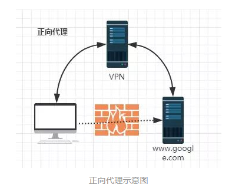
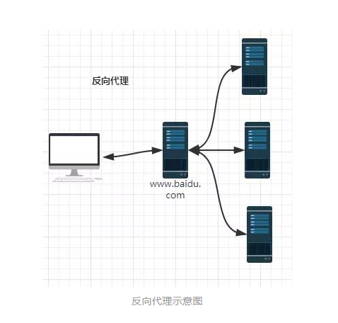
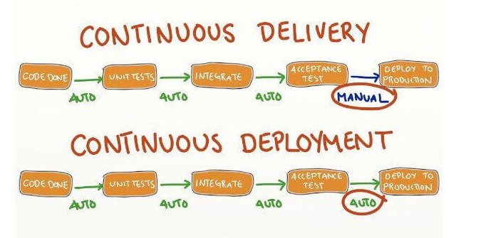
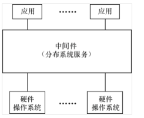

#Tomcat与Apache区别

Apache是web服务器（静态解析，如HTML），tomcat是java应用服务器（动态解析，如JSP）。

Tomcat只是一个servlet(jsp也翻译成servlet)容器，可以认为是apache的扩展，但是可以独立于apache运行。

Apache侧重于http server，Tomcat侧重于servlet引擎。

如果客户端请求的是静态页面，则只需要Apache服务器响应请求

如果客户端请求动态页面，则是Tomcat服务器响应请求

因为jsp是服务器端解释代码的，这样整合就可以减少Tomcat的服务开销。

#Nignx

Nginx是一款轻量级的Web服务器、反向代理服务器，由于它的内存占用少，启动极快，高并发能力强，在互联网项目中广泛应用。

##正向代理

正向代理“代理”的是客户端

##反向代理

反向代理“代理”的是服务器端

资料来源：
https://zhuanlan.zhihu.com/p/34943332

#Dubbo(开源分布式服务框架)

Dubbo是阿里巴巴公司开源的一个高性能优秀的服务框架，使得应用可通过高性能的 RPC 实现服务的输出和输入功能，可以和 [2]  Spring框架无缝集成。

Dubbo是一款高性能、轻量级的开源Java RPC框架，它提供了三大核心能力：面向接口的远程方法调用，智能容错和负载均衡，以及服务自动注册和发现。

#Spring

Spring是一个开放源代码的设计层面框架，它解决的是业务逻辑层和其他各层的松耦合问题，因此它将面向接口的编程思想贯穿整个系统应用。

Spring是一个分层的JavaSE/EE full-stack(一栈式) 轻量级开源框架。

#Spring Boot

Spring 是一个优雅的框架集合，需要小心协调配置才能正确工作。但这种优雅的代价是配置变得很复杂。而Spring Boot只需极少的配置，快速运行一个基于Spring的应用程序。

#Spring Cloud

Spring Cloud是一系列框架的有序集合。它利用Spring Boot的开发便利性巧妙地简化了分布式系统基础设施的开发，如服务发现注册、配置中心、消息总线、负载均衡、断路器、数据监控等，都可以用Spring Boot的开发风格做到一键启动和部署。Spring并没有重复制造轮子，它只是将目前各家公司开发的比较成熟、经得起实际考验的服务框架组合起来，通过Spring Boot风格进行再封装屏蔽掉了复杂的配置和实现原理，最终给开发者留出了一套简单易懂、易部署和易维护的分布式系统开发工具包。

#CI(Continuous Integration)
一次构建：可能包含编译，测试，审查和部署，以及其他一些事情，一次构建就是将源代码放在一起，并验证软件是否可以作为一个一致的单元运行的过程。可以理解为频繁的在多个团队的工作中集成，并且给与反馈的过程。团队开发成员经常集成它们的工作，每次集成都通过自动化的构建（包括编译，发布，自动化测试）来验证，从而尽早地发现集成错误。

CI场景如下：

（1）开发人员向版本控制库提交代码，同时，集成构建计算机上的CI服务器正在轮询检查版本控制库中的变更
（2）在提交发生之后，CI服务器检测到版本控制库中发生了变更，所以CI服务器会从库中取得最新的代码副本，执行构建脚本，该脚本将对软件进行集成
（3）CI服务器向指定的项目成员发成电子邮件，提供构建结果的反馈信息。
（4）CI服务器继续轮询版本控制库中的变更。

CI持续集成周期
一个典型的持续集成周期包括以下几个步骤：
（1）持续集成服务器不断从版本控制服务器上检查代码状态，看代码是否有更新。
（2）如果发现代码有最新的提交，那么就从版本控制服务器下载最新的代码。
（3）等代码完全更新以后，调用自动化编译脚本，进行代码编译。
（4）运行所有的自动化测试。
（5）进行代码分析。
（6）产生可执行的软件，能够提供给测试人员进行测试。

#CD(Continuous delivery and  continuous deployment)
持续交付和持续部署的差别就在于最后一步部署到正式环境是否使用自动化的方式。

持续部署（continuous deployment）是通过自动化的构建、测试和部署循环来快速交付高质量的产品。某种程度上代表了一个开发团队工程化的程度，毕竟快速运转的互联网公司人力成本会高于机器，投资机器优化开发流程化相对也提高了人的效率，让 engineering productivity 最大化。

集成是指软件个人研发的部分向软件整体部分交付，以便尽早发现个人开发部分的问题；

部署是代码尽快向可运行的开发/测试节交付，以便尽早测试；

交付是指研发尽快向客户交付，以便尽早发现生产环境中存在的问题。

如果说等到所有东西都完成了才向下个环节交付，导致所有的问题只能再最后才爆发出来，解决成本巨大甚至无法解决。

而所谓的持续，就是说每完成一个完整的部分，就向下个环节交付，发现问题可以马上调整。是的问题不会放大到其他部分和后面的环节。

#中间件
中间件是一种独立的系统软件或服务程序，分布式应用软件借助这种软件在不同的技术之间共享资源。中间件位于客户机/ 服务器的操作系统之上，管理计算机资源和网络通讯。是连接两个独立应用程序或独立系统的软件。相连接的系统，即使它们具有不同的接口，但通过中间件相互之间仍能交换信息。执行中间件的一个关键途径是信息传递。通过中间件，应用程序可以工作于多平台或OS环境。

#MyCat(数据库分库分表中间件)

+一个彻底开源的，面向企业应用开发的大数据库集群
+支持事务、ACID、可以替代MySQL的加强版数据库
+一个可以视为MySQL集群的企业级数据库，用来替代昂贵的Oracle集群
+一个融合内存缓存技术、NoSQL技术、HDFS大数据的新型SQL Server
+结合传统数据库和新型分布式数据仓库的新一代企业级数据库产品
+一个新颖的数据库中间件产品
+基于阿里开源的Cobar研发

#Cobar(关系型数据库分布式服务的中间件)
Cobar是阿里巴巴研发的关系型数据的分布式处理系统，是提供关系型数据库（MySQL）分布式服务的中间件，该产品成功替代了原先基于Oracle的数据存储方案，它可以让传统的数据库得到良好的线性扩展，并看上去还是一个数据库,对应用保持透明。

#DRDS(阿里云分布式关系型数据库服务)
DRDS 成熟的分布式架构，可以提供给用户使用单机数据库一致的体验，底层通过分布式的架构轻松实现数据库的高扩展性，降低开发成本的同时，也提升了数据库存储和服务扩展能力。

#DRDS与MySQL、NoSQL的区别
MySQL核心优势是关系模型ACID特性和事务一致性，但MySQL在保持ACID特性一致性的原则下，单机数据库的扩展给开发和运维带来了巨大的成本。NOSQL则在抛弃关系模型特性的情况下，通过分布式的方式解决了数据库的高扩展性，但是面对复杂多样的关系模型的使用场景NOSQL不能作为一种通用的数据库解决方案使用，且NOSQL推出的时间短，产品成熟度不高，系统稳定性和可运维行较差，对于正式生产环境使用风险仍旧很高。

分布式关系型数据库DRDS则在保持关系模型的特性和数据库高扩展性发做了很好的平衡，实现数据库的高扩展性的同时，也最大化的保持了关系型数据ACID特性和事务一致性。

#solr

Solr（读作“solar”）是Apache Lucene项目的开源企业搜索平台。其主要功能包括全文检索、命中标示、分面搜索、动态聚类、数据库集成，以及富文本（如Word、PDF）的处理。Solr是高度可扩展的，并提供了分布式搜索和索引复制。Solr是最流行的企业级搜索引擎，Solr 4还增加了NoSQL支持。

Solr是用Java编写、运行在Servlet容器（如Apache Tomcat或Jetty）的一个独立的全文搜索服务器。 Solr采用了Lucene Java搜索库为核心的全文索引和搜索，并具有类似REST的HTTP/XML和JSON的API。 Solr强大的外部配置功能使得无需进行Java编码，便可对其进行调整以适应多种类型的应用程序。Solr有一个插件架构，以支持更多的高级定制。

#Elasticsearch
Elasticsearch是一个基于Apache Lucene(TM)的开源搜索引擎。无论在开源还是专有领域，Lucene可以被认为是迄今为止最先进、性能最好的、功能最全的搜索引擎库。

#SOA (Service-Oriented Architecture) 
面向服务的架构（SOA）是一个组件模型，它将应用程序的不同功能单元（称为服务）进行拆分，并通过这些服务之间定义良好的接口和契约联系起来。接口是采用中立的方式进行定义的，它应该独立于实现服务的硬件平台、操作系统和编程语言。这使得构建在各种各样的系统中的服务可以以一种统一和通用的方式进行交互。

#RESTful
RESTful 是目前最流行的 API 设计规范，用于 Web 数据接口的设计。
主流通信协议经过发展，主要分为两种

1.文本协议
    使用最广泛的多是基于HTTP的RESTful规范

2.轻量级二进制协议
    Thrift、Protobuf，或者任何自定义的轻量级协议

#I/O多路复用技术
I/O 多路复用的特点是通过一种机制一个进程能同时等待多个文件描述符，，而这些文件描述符（套接字描述符）其中的任意一个进入读就绪状态，系统函数就可以返回。

注：使用I/O多路复用技术并不一定比多进程+阻塞I/O性能好（单次链接I/O多路复用调用了两次系统调用，第一次:等待I/O,第二次:select,epoll,poll监听）

#CGI(common gateway interface) 通用网关接口

理论上来说，所有支持标准输出，支持获取环境变量的编程语言都能用来编写CGI程序。

网关：协议翻译机

#gflags
GFlags是Google开源的一个命令行flag（区别于参数）库。和 getopt() 之类的库不同，flag的定义可以散布在各个源码中，而不用放在一起。一个源码文件可以定义一些它自己的flag，链接了该文件的应用都能使用这些flag。这样就能非常方便地复用代码。如果不同的文件定义了相同的flag，链接时会报错。
gflags可以reload配置信息（SetCommandLineOption），GetCommandLineOption(线程安全接口读取配置信息)

#RAII
RAII是Resource Acquisition Is Initialization（wiki上面翻译成 "资源获取就是初始化"）的简称，是C++语言的一种管理资源、避免泄漏的惯用法。利用的就是C++构造的对象最终会被销毁的原则。RAII的做法是使用一个对象，在其构造时获取对应的资源，在对象生命期内控制对资源的访问，使之始终保持有效，最后在对象析构的时候，释放构造时获取的资源。

